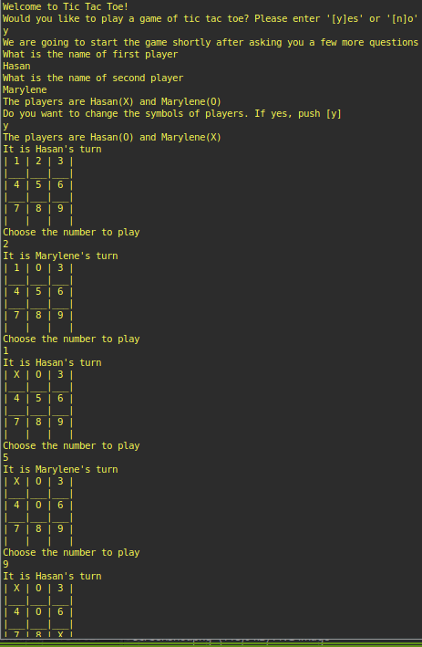

# tic_tac_toe


This is a project in the Main Ruby curriculum at [Microverse](https:www.microverse.org/) - @microverseinc.

# tic_tac_toe_game ([The Odin Project](https://www.theodinproject.com/courses/ruby-programming/lessons/oop))



## Built With

- Ruby

## Description

The task was to implement a [Tic Tac Toe game](https://www.theodinproject.com/courses/ruby-programming/lessons/oop).

This project is mainly about

-  Object Oriented Programming
-  The [DRY rule](https://en.wikipedia.org/wiki/Don%27t_repeat_yourself)

## How to Play the Game

* In order to play the Tic Tac Toe game just run the execution script in the terminal by typing `main` and follow the prompt
```
main
```

## Live Demo

[](https://github.com/ozovalihasan/tic_tac_toe)

## Authors

👤 **Marylene Sawyer**
- Github: [@Bluette1](https://github.com/Bluette1)
- Twitter: [@MaryleneSawyer](https://twitter.com/MaryleneSawyer)
- Linkedin: [Marylene Sawyer](https://www.linkedin.com/in/marylene-sawyer-b4ba1295/)

👤 **Hasan Özovalı**

- Github: [@ozovalihasan](https://github.com/ozovalihasan)
- Twitter: [@ozovalihasan](https://twitter.com/ozovalihasan)
- Linkedin: [Hasan Özovalı](https://www.linkedin.com/in/hasan-ozovali/)
- Mail: [ozovalihasan@gmail.com](ozovalihasan@gmail.com) 

## 📝 License

This project is [MIT](https://opensource.org/licenses/MIT) licensed.