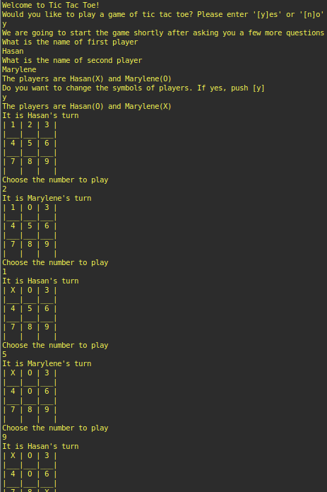

# tic-tac-toe


This is a project in the Main Ruby curriculum at [Microverse](https://www.microverse.org/) - @microverseinc .




## Built With

- Ruby
- Rspec

## Description

The task was to implement a [Tic Tac Toe game](https://www.theodinproject.com/courses/ruby-programming/lessons/oop).

This project is mainly about

-  Object Oriented Programming
-  The [DRY rule](https://en.wikipedia.org/wiki/Don%27t_repeat_yourself)

## How to Play the Game
* Clone this github repo onto your local machine
* In the terminal move to the home directory of this repo 
* Type the following commands

  ```
  cd bin 
  ./main
  ```
* Alternatively, you can create an executable script `main` ([Read About How to Create an Executable Script](https://commandercoriander.net/blog/2013/02/16/making-a-ruby-script-executable/)) 
 - In order to play the Tic Tac Toe game just run the executable script in the terminal by typing `main` and follow the prompt
   ```
   main
   ```

## Rules of the Game

- Players' names  can be entered at the beginning of the game
- Players can choose 'X' or 'O' as a symbol
- To win the game, three identical symbols must be next to each other vertically, horizontally, or diagonally. If there is a winner, the winner will be announced as "WINNER"
- If no one has won by the end of ninth turn, the game will be ended as a "DRAW"

For more information check [Wikipedia](https://en.wikipedia.org/wiki/Tic-tac-toe )

## Live Demo


[](https://repl.it/github/ozovalihasan/tic-tac-toe)

## Testing
To test the project
1. Navigate to the directory where the project is located.
2. Open terminal in this directory.
3. Install RSpec by using `gem install rspec` command.
4. Start testing by using `rspec` command.


## Authors

👤 **Marylene Sawyer**
- Github: [@Bluette1](https://github.com/Bluette1)
- Twitter: [@MaryleneSawyer](https://twitter.com/MaryleneSawyer)
- Linkedin: [Marylene Sawyer](https://www.linkedin.com/in/marylene-sawyer-b4ba1295/)

👤 **Hasan Özovalı**

- Github: [@ozovalihasan](https://github.com/ozovalihasan)
- Twitter: [@ozovalihasan](https://twitter.com/ozovalihasan)
- Linkedin: [Hasan Özovalı](https://www.linkedin.com/in/hasan-ozovali/)
- Mail: [ozovalihasan@gmail.com](ozovalihasan@gmail.com) 

👤 **Prajwal Thapa** 
    
- LinkedIn: [Prazwal Thapa](www.linkedin.com/in/prazwal-thapa/) 
- GitHub: [@praz99](https://github.com/praz99)
- E-mail: t.prazwal@gmail.com

## 📝 License

This project is [MIT](https://opensource.org/licenses/MIT) licensed.